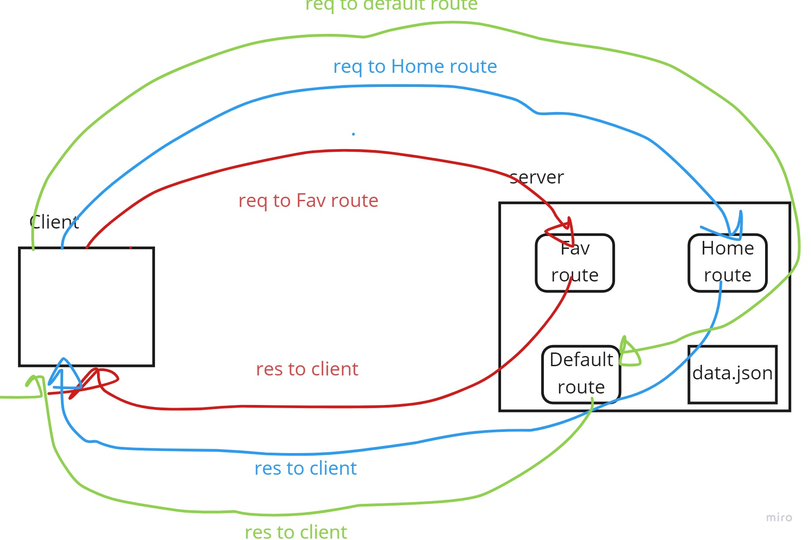

# toqawasfi-Movies-Library
# Project Name - Project Version

**Author Name**: Movies-Library

## WRRC

## Overview
Building  a server regarding movies contains three routes(Home,Fav,Defualte)
## Getting Started
<!-- What are the steps that a user must take in order to build this app on their own machine and get it running? -->
defininig WRRC,Initilizing server,instaling & importing required libs & workframes,defining Port,starting the server,and buildings our routes

## Project Features
<!-- What are the features included in you app -->
contains three routes(Home,Fav,Defualte)
